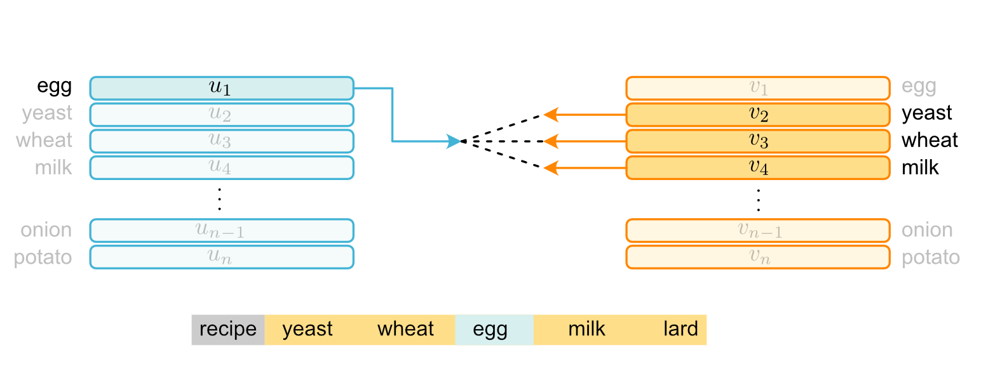
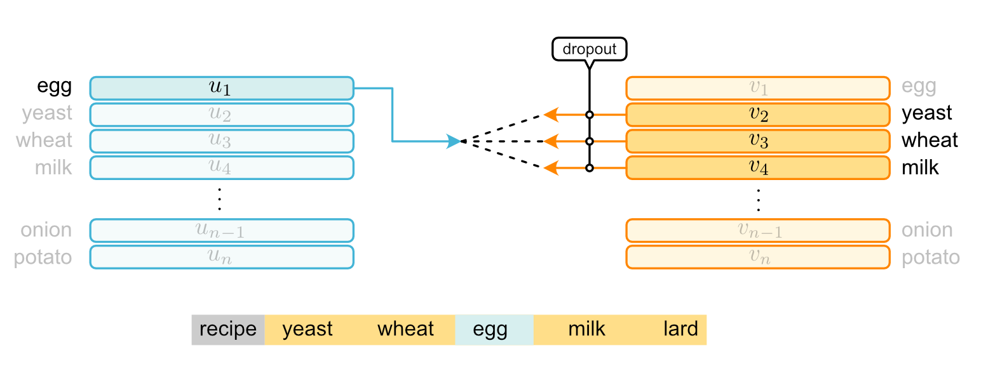
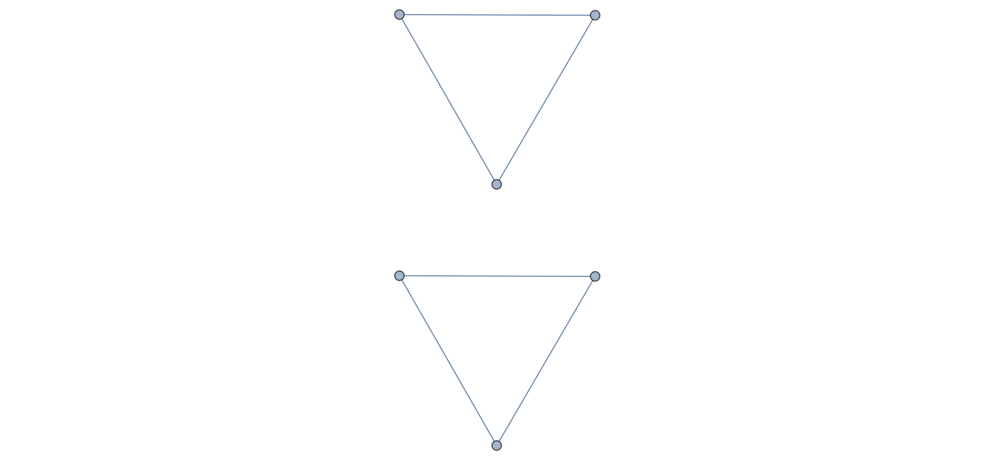
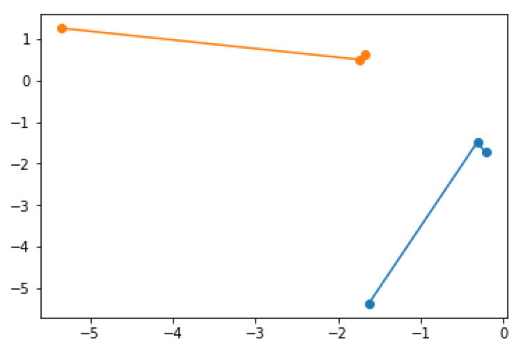

# World Embedding and Dropout

## Method

Original skip-gram word embedding:

word embedding with dropout:

## Result

If we embed the simple network:

Using the traditional method, we have:

And the embedding vector is:

But, if we use dropout, we have a much better result:

And the vectors are:

Two groups are separated in both code and space.